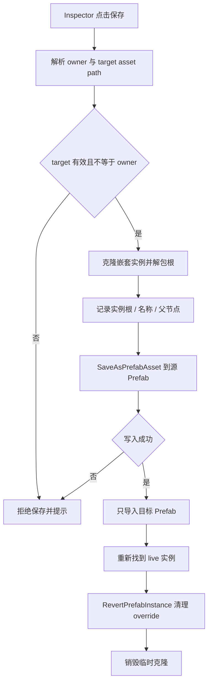

# Ultimate Skill Camera Timeline Generator 开发经验沉淀

> 本文记录 `UltimateSkillCameraTimelineGenerator` 在 Prefab 保存、嵌套 Prefab、本地预设、Odin 工具界面和验证过程中的工程经验。后续开发 Unity Editor 工具、Timeline 生成器或 Prefab 批量编辑器时，可把本文当作排查与实现参考。

## 先看结论

这类工具最容易出问题的不是“生成文件”，而是**资产边界不清**：

- 当前操作的是主 Timeline Prefab，还是嵌套在它里面的子 Prefab。
- 当前修改只应落盘到哪一个源 Prefab。
- 保存后，原实例上的 override 是否要保留、同步或清理。
- 工具参数应该写进 `Assets/`，还是只留在本机 `Library/` 或 `EditorPrefs`。

处理顺序应当是：先确定资产归属与写入边界，再设计保存 API，最后做界面和批量功能。反过来先堆按钮、后补边界，通常会把外层 Prefab 误删、误覆盖或生成两份内容。

## 工具背景

入口：`TA_Tools/Animation/技能大招资产生成器`

主要代码：

| 文件 | 职责 |
| --- | --- |
| `UltimateSkillCameraTimelineGeneratorWindow.cs` | 大招模式生成、Timeline / Prefab 组装、通用收集与校验 |
| `UltimateSkillCameraTimelineGeneratorWindow.UI.cs` | Odin 窗口布局、模式切换、生成按钮 |
| `UltimateSkillCameraTimelineGeneratorWindow.Presentation.cs` | 剧情过场、抽卡角色表演生成 |
| `UltimateSkillCameraTimelineGeneratorWindow.Validation.cs` | 生成前校验与生成后自检 |
| `UltimateSkillCameraTimelineGeneratorWindow.Presets.cs` | 本地预设快照、保存、加载、删除 |
| `UltimateTimelineBindingsEditor.cs` | 场景预览绑定、嵌套 FX 保存到源 Prefab |

工具同时处理主 Timeline、主 Prefab、ID 镜头 Prefab、FX Prefab、动画 Clip、AudioClip、道具 Prefab 和场景对象。它不是一个只改字段的 Inspector，而是典型的**多资产编辑器**。

## 经验一：先定义资产边界

### 主 Prefab 与嵌套 Prefab 不是同一种对象

在 Prefab Mode 外面看到的是主 Timeline Prefab 实例。`fx_group` 下的 FX、`prop_group` 下的道具、`camAni_group` 下的镜头，往往又是嵌套 Prefab 实例。

同一套修改逻辑不能无脑复用：

| 操作目标 | 应写入的资产 | 不能写入的资产 |
| --- | --- | --- |
| 主 Timeline 结构、主 Prefab 层级 | 主 Timeline `.playable` + 主 Prefab `.prefab` | 嵌套 FX / 镜头 / 道具源 Prefab |
| `fx_group` 中某个 FX 的改动 | 该 FX 的源 `.prefab` | 外层主 Timeline Prefab |
| 配置了动画的道具 | 该道具源 `.prefab`（仅补 Animator 时） | 主 Prefab、其它道具 |
| 预览绑定 | 当前场景实例 | 主 Prefab 资产 |

### 实践规则

1. 写资产前先解析 owner asset path 与 target asset path。
2. target 与 owner 相同时，拒绝写入或要求调用方明确说明。
3. 不允许无校验地使用 `SaveAsPrefabAsset` 覆盖未知路径。
4. 嵌套 Prefab 的源解析优先用 `GetPrefabAssetPathOfNearestInstanceRoot`，必要时回退到 `GetCorrespondingObjectFromOriginalSource`。
5. 单独保存嵌套 Prefab 时，不调用会顺手保存其它 Dirty 资产的全局保存 API。

## 经验二：嵌套 Prefab 保存要分三段

### 问题现象

在主 Timeline 实例上直接保存嵌套 FX 时，容易出现：

- `GetCorrespondingObjectFromSource` 返回 `null` 或返回外层对象，触发 `ArgumentNullException`。
- 改写到了外层 Timeline Prefab，导致主 Prefab 内容丢失或结构被替换。
- 源 Prefab 保存了，但原实例还保留一份 override，Hierarchy 里看起来有两份。
- 保存一个嵌套 Prefab 后，其它对象引用失效，后续写入建立在失效引用上。

### 解决方案

采用 **快照 -> 写源资产 -> 清理实例覆盖** 三段式。

#### 第一段：先做快照

在写任何资产前，先把要保存的实例克隆出来，并记录恢复所需信息：

- 克隆的 `GameObject`
- 原嵌套实例根
- 目标源 Prefab 路径
- 实例名称
- 原父节点

关键点：

- `SaveAsPrefabAsset` 接收的必须是普通根对象，不能是仍指向待覆盖资产的 Prefab 实例根。
- 克隆根如果仍属于 Prefab 实例，要通过 `UnpackPrefabInstance(..., PrefabUnpackMode.OutermostRoot, ...)` 解掉关联，避免保存时形成自引用。
- 所有子对象引用要在导入前抓完。导入资产会让原本的 live hierarchy 引用失效。

#### 第二段：只写源 Prefab

保存时：

1. 解析并校验目标 `.prefab`。
2. 拒绝目标指向主 Timeline Prefab。
3. 调用 `SaveAsPrefabAsset(clone, assetPath, out bool success)`。
4. 失败时把 Unity 的返回值当失败处理，不能只看是否抛异常。

#### 第三段：同步导入并清理 override

源资产保存后：

1. 只对目标源 Prefab 调用 `AssetDatabase.ImportAsset(..., ForceSynchronousImport | ForceUpdate)`。
2. 不做全局 `AssetDatabase.SaveAssets()`，避免把外层 Prefab 和其它 Dirty 资产一并写盘。
3. 重新解析原 live 嵌套实例。
4. 对 live 实例执行 `PrefabUtility.RevertPrefabInstance`，让新源 Prefab 成为基准，清掉旧实例新增子节点和属性 override，避免 Hierarchy 中两份相同内容。

### 流程



## 经验三：不要把“实例修改”和“源 Prefab 保存”混为一谈

Prefab 实例上的改动有两种状态：

- 已保存进源 Prefab：所有实例共享。
- 仍是实例 override：只属于当前实例，容易和源内容重复。

如果工具的目标是“保存到源 Prefab”，保存后原实例就不应该继续显示旧 override。否则会出现：

```text
源 Prefab 已包含新节点
原实例仍然保留同样的 AddedGameObject override
Hierarchy 中看到两份一模一样的内容
```

因此 `RevertPrefabInstance` 不是可选的“美化步骤”，而是保存语义的一部分。

## 经验四：道具动画与 Animator 的边界

当道具配置了动画时，Timeline 的 `AnimationTrack` 需要一个 Animator 绑定目标。工具采取的规则是：

- 未配置动画：完全不处理该道具 Prefab。
- 配置动画且整棵 Prefab 都没有 Animator：自动补一个无 Controller 的 Animator。
- 已经有 Animator：只复用，不重写源 Prefab。

实现细节：

- 使用 `PrefabUtility.LoadPrefabContents` 打开源 Prefab。
- 用 `GetComponentInChildren<Animator>(true)` 检查整棵层级，避免子节点已有 Animator 时又在根节点加第二个。
- 只有真的新增组件时才调用 `SaveAsPrefabAsset`。
- 在 `finally` 中调用 `UnloadPrefabContents`。

这条规则可以推广为：

> 工具只在“没有可用组件且该组件是功能必需”时补组件；不要借生成流程顺手补无关组件。

## 经验五：本地预设的目标是复用参数，不是保存资产

### 设计原则

预设应保存“打开工具后要继续编辑的参数”，不应保存生成结果，也不应污染工程资产。

本项目采用：

| 内容 | 存储位置 |
| --- | --- |
| 预设文件 | `Library/TA_Tools/UltimateSkillCameraTimelineGenerator/Presets/*.json` |
| 上次使用的预设名 | `EditorPrefs` |
| 工具运行时参数 | 窗口自身的 `[SerializeField]` 字段 |
| 生成结果 | `Assets/` 下的 Timeline / Prefab / Clip |

放在 `Library/` 的原因是：

- 不进入 `Assets/`，不会被打包。
- 不产生 `.meta`，不污染版本库。
- 每台机器可以有不同预设。
- 工具重开、Unity 重启后仍可复用。

### 实现方式

#### 1. 用 SerializedObject 做通用快照

不要为每个字段手写 Save/Load。字段一多，增删字段就会漏。

当前实现从窗口根属性开始：

```csharp
_productionMode
_settings
_storySettings
_gachaSettings
```

用 `SerializedObject` + `SerializedProperty` 递归捕获：

- 基础类型：int、enum、bool、float、string 直接写字符串。
- 数组：记录 array size，再递归记录每个元素。
- Generic：递归记录子属性。
- ObjectReference：记录 Asset GUID 与 localFileId，而不是只存路径。

#### 2. 资源引用用 GUID + localFileId

只保存路径会出问题：

- 资源被移动后路径失效。
- FBX 内的子资源用路径无法唯一定位。

保存时：

```csharp
AssetDatabase.GetAssetPath(value)
AssetDatabase.TryGetGUIDAndLocalFileIdentifier(value, out guid, out localFileId)
```

加载时：

- 先用 GUID 反查资源路径。
- 再按 localFileId 在 `LoadAllAssetsAtPath` 结果中找到对应子资源。
- 找不到时回退到主资源并记录 MissingAssets，不要中断整个预设加载。

#### 3. Snapshot 结构

```json
{
  "schemaVersion": 1,
  "properties": [
    {
      "path": "_settings.heroId",
      "propertyType": 4,
      "isArray": false,
      "value": "100601"
    }
  ]
}
```

增加 `schemaVersion` 后，以后字段结构不兼容时可以拒绝旧预设并提示重新保存。

#### 4. 加载策略

加载预设时：

1. `serializedObject.Update()`。
2. 按保存的 property path 查找当前字段。
3. 找得到就写回。
4. 找不到就记入 `MissingProperties`，继续加载其它字段。
5. `ApplyModifiedPropertiesWithoutUndo()`。
6. 重新执行 `EnsureSettingsDefaults` 和模式默认值补齐。

这样字段增删不会让整个预设报废，旧预设仍能尽量恢复。

#### 5. 默认预设名

预设名为空时动态生成：

| 模式 | 默认名 |
| --- | --- |
| 大招技能 | `<角色编号>_<技能名称>` |
| 剧情过场 | 演出名称 |
| 抽卡角色表演 | 角色编号 |

只有在用户手动保存或加载过具体预设后，才固定 `_presetName`。这样默认名会跟当前配置联动，又不会在改参数时误覆盖已保存预设。

#### 6. 文件名校验

预设名直接参与文件名，因此必须处理：

- 空字符串
- 非法文件名字符
- 结尾点号
- `.` 与 `..`

当前策略是把非法字符替换为 `_`，再拒绝无效结果。

## 经验六：Odin 界面要服务操作流

### 同组操作放同一行

预设区把四个操作放同一水平组：

```csharp
[HorizontalGroup(PresetRootGroup + "/预设操作", Width = 0.25f)]
```

保存、加载、删除、打开目录属于同一组操作，横向排列能减少纵向滚动和误点。

### 名称字段与加载入口放一起

预设名使用 `ValueDropdown` 显示现有预设，同时配 `InlineButton` 提供快速加载。这样用户既能选已有名字，也能直接点加载。

### 窗口状态用 SerializeField

工具参数使用 `[SerializeField]`，脚本重编译后仍保留。临时状态、提示信息则用普通字段，不必全部落盘。

### 复杂窗口仍优先 OdinEditorWindow

本项目工具使用 `OdinEditorWindow`，原因是需要：

- 折叠分组
- 水平按钮组
- 动态显示/隐藏
- 颜色
- 列表拖动
- 自定义字段标签

如果只是单次批处理，不要为了统一风格强上 Odin。

## 经验七：生成器必须区分生成、组装和保存

工具中的行为分为：

| 操作 | 作用 |
| --- | --- |
| 只生成 | 生成模块资源，不动主 Timeline |
| 组装 | 只把某模块重组进已有主 Timeline / Prefab |
| 生成并组装全部 | 从输入到主资产完整执行 |
| 保存到源 Prefab | 只保存嵌套子 Prefab，不保存外层 |

这种拆分让美术能局部重做，不会因为只改一个 FX 就重建全部资源。

实现时要注意：

- 每个 Scope 只处理自己负责的模块。
- 局部组装不能清空其它模块或美术手动内容。
- 保存嵌套 Prefab 不能顺手保存外层 Prefab。
- 生成失败时保留原资产，不要先删后建。

## 经验八：覆盖更新要保留 GUID

Timeline、Prefab、FX、PostProcess 等资产被引用后，路径和 GUID 都是外部契约。

优先做法：

1. 已存在资源按原路径更新。
2. Prefab 用 `LoadPrefabContents` 修改后写回原路径。
3. 不新建“同名新文件”再替换。
4. 不主动删美术新增的非工具轨道和节点。
5. 只清理工具自己拥有和可识别的节点。

主 Prefab 中工具独占节点的清空再回填，可以避免重复生成越堆越多；非工具节点保持不动。

## 经验九：两遍保存解决 ExposedReference

Timeline 的 ExposedReference 依赖对象 fileID。新对象刚生成时 fileID 还不稳定，第一遍直接写引用容易丢失。

采用两遍保存：

1. 第一遍创建完整层级并保存，让新对象拿到稳定 fileID。
2. 第二遍重新 `LoadPrefabContents`，再写 ExposedReference，再保存。

第二遍不要再重新设置 PlayableAsset，也不要无意义 `RebuildGraph`，否则可能把引用表冲掉。

取引用名时必须读序列化字段，不能依赖 `PropertyName.ToString()`。后者会带内部 id，不适用于名称比较。

## 经验十：验证要覆盖静态、资产和运行时

不同层级的验证不能互相替代。

| 层级 | 能验证什么 | 不能证明什么 |
| --- | --- | --- |
| 编译检查 | 类型、API、语法 | Prefab 保存结果 |
| 批处理 / SmokeTest | 生成流程、资产结构、引用写盘 | 动画观感、相机表现 |
| Unity 内生成 | Prefab、Timeline、绑定、层级 | 最终战斗表现 |
| 场景 / Play Mode | 播放、镜头、特效、音效、道具 | 其它平台或其它角色资源 |

### 编译检查

Unity 运行时可使用 Bee 的真实 `Assembly-CSharp-Editor.rsp`，复制到临时目录后替换输出路径，再用 Unity 自带 Roslyn 执行。这样比仅做文本检查更接近真实编译环境。

### Prefab 专项验证

至少检查：

- 配置动画的道具源 Prefab 是否出现且只出现一个 Animator。
- 未配置动画的道具是否完全没变。
- 保存嵌套 FX 后，外层 Timeline Prefab 是否未被改动。
- 原实例 override 是否已清理，Hierarchy 中是否只有一份。
- 源 Prefab 的 `.meta` GUID 是否保持不变。

### 预设专项验证

至少检查：

- 保存后 `Library/.../Presets/*.json` 是否生成。
- 关闭并重开窗口后是否自动加载上次预设。
- 资源移动或删除后，预设加载是否仍能完成并给出缺失提示。
- 预设名默认值是否随角色编号和技能名变化。
- 多个预设之间切换是否覆盖正确字段。
- 预设文件是否没有进入 `Assets/`。

## 常见坑与处理

| 问题 | 根因 | 处理 |
| --- | --- | --- |
| `GetCorrespondingObjectFromSource` 行为异常或返回 null | 嵌套层级下取到的不是最近 Prefab 根 | 先取 nearest instance root，必要时回退 original source |
| 保存嵌套 FX 后主 Prefab 丢失 | target path 解析成外层 Prefab | 写前比较 target 与 owner，相同则拒绝 |
| Hierarchy 中出现两份内容 | 源 Prefab 已保存，原实例 override 未清 | 保存后 `RevertPrefabInstance` |
| 保存一个子 Prefab 影响其它修改 | 使用了全局 SaveAssets | 只 Import 目标资产 |
| 资源移动后预设引用失效 | 只保存了路径 | 存 GUID + localFileId |
| 道具子节点已有 Animator 却又补一个 | 只检查根节点 | 用 `GetComponentInChildren<Animator>(true)` |
| 配置动画前的普通道具也被改 | 生成前未按动画列表过滤 | 只有 animations 非空才处理 |
| 按钮太多导致界面过长 | 每个按钮单独一行 | 同组操作使用 HorizontalGroup |
| 预设默认名不跟随配置 | 把默认名直接写进序列化字段 | 空值动态计算，手动命名后再固定 |
| 字段增删导致旧预设无法用 | 强绑定旧结构 | 按 property path 容错加载并报告缺失字段 |

## 可直接复用的实现模板

### 1. 本地预设存放

```text
<ProjectRoot>/Library/TA_Tools/<ToolName>/Presets/*.json
EditorPrefs key: <Company>.<Namespace>.<ToolName>.LastPreset
```

### 2. 预设快照

```csharp
PresetSnapshot
  schemaVersion
  properties[]

PresetPropertySnapshot
  path
  propertyType
  isArray
  arraySize
  value
  objectGuid
  objectLocalFileId
  objectAssetPath
  children[]
```

### 3. 保存流程

```text
校验名称
  -> CapturePresetSnapshot
  -> Directory.CreateDirectory
  -> File.WriteAllText(json)
  -> EditorPrefs.SetString(lastPreset)
```

### 4. 加载流程

```text
读取 JSON
  -> 校验 schemaVersion
  -> ApplyPresetSnapshot
  -> 缺失字段 / 缺失资源生成提示
  -> 补齐工具默认值
  -> EditorPrefs.SetString(lastPreset)
```

### 5. 嵌套 Prefab 保存流程

```text
解析最近嵌套根与源路径
  -> 拒绝 owner 路径
  -> 克隆实例并解包根
  -> 保存到源 Prefab
  -> 只导入目标资产
  -> 找回 live 实例
  -> RevertPrefabInstance
  -> 销毁临时克隆
```

## 设计清单

开发同类工具前逐项确认：

- [ ] 每个写入操作的目标资产路径是什么？
- [ ] 会不会影响外层 Prefab 或其它 Dirty 资产？
- [ ] 资源保存后需要保留、同步还是清理实例 override？
- [ ] 已存在资源是否按原路径更新并保留 GUID？
- [ ] 工具新增组件是否只在功能必需时发生？
- [ ] 工具节点与美术手动节点的边界是否明确？
- [ ] 参数保存是否不进入 `Assets/`？
- [ ] 预设中的资源引用是否使用 GUID + localFileId？
- [ ] 字段增删后旧预设是否可以容错加载？
- [ ] 界面操作是否分组清晰、避免误点？
- [ ] 静态编译、批处理和 Unity 内验证是否都安排了？

## 一句话总结

多资产 Editor 工具的核心不是“把文件写出来”，而是**准确控制修改属于哪个资产、保存到什么路径、保存后如何同步实例状态**；本地预设则是把可复用参数与工程资产生命周期彻底分离。

#

# 2026-09-24 最终口径与可迁移规则

> 类型：`PROFILE + REFERENCE`。本节记录 ProjectACG 当前实现的最终合同，并把已经验证的实现模式提炼成可迁移规则。迁移到其他 Unity 工程时，必须重新核对 Unity 版本、Prefab 结构、Timeline 绑定和运行时消费者。

## 1. 最终合同：路径、名称与功能边界

### 1.1 输出目录必须服从窗口选择

生成器的 `outputFolder` 是唯一的用户输出目录来源：

- 选择了有效的 `Assets/` 文件夹时，主 Timeline、主 Prefab 以及 `cam/`、`fx/`、`pp/` 等模块目录都在该目录下生成。
- 工具不会因为目录名称缺少 `hero`，就把路径自动搬到 `Assets/AssetRaw/character/hero/<角色编号>/timeline/New`。
- 没有选择有效目录时，才回退到 `Assets/AssetRaw/character/hero/<角色编号>/timeline/New`，该目录不存在时再回退到 `timeline`。
- 因此，资源名去掉 `hero / weapon / monster / boss` 与输出路径是两个独立问题，不能用改名逻辑改写路径。

示例：如果窗口选择的是 `Assets/AssetRaw/character/hero/100601/timeline/New`，生成结果必须留在这个目录；如果选择的是 `Assets/AssetRaw/character/100101`，它也是有效 `Assets/` 目录，工具必须在这个目录下生成，而不是另建 `New`。

### 1.2 只有主资源名称去掉类别词

当前大招主资源命名为：

~~~text
tl_<角色编号>_<技能名称>.playable
tPre_<角色编号>_<技能名称去掉 bigskill 前导零>.prefab
~~~

例如：

~~~text
tl_100601_bigskill02.playable
tPre_100601_bigskill2.prefab
~~~

这里去掉的是主 Timeline 和主 Prefab 名称中的类别层，不是删除目录层，也不是修改角色资源根目录。模块资源仍按职责保留明确前缀：

~~~text
tPre_fx_<角色编号>_<特效名>.prefab
tl_fx_<角色编号>_<特效名>.playable
pp_fx_<角色编号>_<特效名>.asset
ani_c_hero_cam_<镜头编号>_<角色编号>_<技能名>.anim
tPre_cam_<镜头编号>_<角色编号>_<技能名>.prefab
~~~

资源名称、资源目录、资源内容是三个独立契约。修改其中一个时，必须说明另外两个是否保持不变。

### 1.3 已取消的相机同步需求不能重新引入

曾经提出过“生成主 Timeline Prefab 时添加 `UltimateTimelineCameraTransformSync`，并把 `cameraAnimationSource` 指向 `Battle_CameraPos`”，随后已明确取消。当前合同是：

- 不在生成结果中重新添加 `UltimateTimelineCameraTransformSync`。
- 不为该组件配置 `cameraAnimationSource`。
- 独立镜头 Prefab 保持纯机位数据，不挂 Animator Controller、PlayableDirector、Cinemachine 或同步组件。
- 虚拟相机链路仍可以使用 `Battle_CameraPos`、共享 Animator 和 `CameraAnimation` 轨道；这不等于恢复旧同步组件。
- 生成后的镜头归一化与自检应继续清理或拒绝旧同步组件，避免旧资产把两套驱动方式叠加。

### 1.4 生成、组装和独立保存是三种不同操作

| 操作 | 允许修改 | 不应顺手修改 |
| --- | --- | --- |
| 只生成模块 | 模块资源和功能必需的源资源最小改动 | 主 Timeline 结构和无关模块 |
| 模块组装 | 已有主 Timeline / 主 Prefab 中的目标模块 | 其它模块、美术手工节点 |
| 生成并组装全部 | 本次生成范围内的完整资产链 | 无关资产和其它 Dirty 资产 |
| 保存到源 Prefab | 选中的嵌套子 Prefab 源文件 | 外层主 Timeline Prefab |

生成失败时优先保留原资源，不采用“先删除所有内容再重建”的破坏式策略。重复生成应按原路径更新并尽量保留 GUID。

## 2. 嵌套 Prefab 独立保存规则

### 2.1 问题、根因与结论

最初的 `ArgumentNullException` 来自把空对象传给 `PrefabUtility.GetCorrespondingObjectFromSource<TObject>`。更深层的根因是：嵌套 Prefab 的“最近实例根”和外层 Prefab 的原始来源不一定相同；错误地使用外层来源会把保存目标解析成主 Timeline Prefab。

保存语义必须固定为：**从主 Timeline Prefab 的 Hierarchy 实例出发，只把 `fx_group` 下选中的嵌套 FX 写回它自己的源 Prefab，外层 Prefab 不保存。**

### 2.2 推荐实现顺序

~~~text
校验当前对象是 Hierarchy 中的嵌套实例
  -> 获取 owner 主 Prefab 路径
  -> 获取最近嵌套实例根路径
  -> 必要时回退到 original source 路径
  -> 拒绝 target == owner
  -> 克隆所有待保存实例
  -> 解包克隆根，避免自引用
  -> SaveAsPrefabAsset 到 target
  -> 只 Import target
  -> 找回 live 实例
  -> RevertPrefabInstance 清理旧 override
  -> 销毁临时克隆
~~~

关键实现要求：

- 保存入口拒绝 Project 资源和 Prefab Mode 对象，要求用户从 Hierarchy 中的主 Timeline Prefab 实例操作。
- 优先调用 `GetPrefabAssetPathOfNearestInstanceRoot`；`GetCorrespondingObjectFromOriginalSource` 只作为回退。
- 写入前比较 owner 路径和 target 路径，路径相同或 target 不是 `.prefab` 时立即拒绝。
- 调用 `SaveAsPrefabAsset` 的克隆根必须是普通根对象；如果仍关联待覆盖 Prefab，先用 `UnpackPrefabInstance` 解包。
- 写入前先完成所有实例快照。Prefab 导入会使原 Hierarchy 引用失效，不能在写入过程中继续依赖旧引用。
- 只对目标资源调用 `AssetDatabase.ImportAsset`，不要用全局 `AssetDatabase.SaveAssets()` 把外层 Prefab 或其它 Dirty 资产一起写盘。
- 源 Prefab 写入成功后，对原 live 实例执行 `RevertPrefabInstance`。源文件已经包含本次修改，旧的 AddedGameObject 和属性 override 若不清理，就会在 Hierarchy 中出现两份相同内容。

### 2.3 手动使用步骤

1. 在 Project 中把主 Timeline Prefab 拖入场景或打开其可编辑实例。
2. 在 Hierarchy 选中主 Prefab 上的 `UltimateFxGroupBindings` 对象。
3. 在 Inspector 点击“保存到源 Prefab”。
4. 只检查 `fx_group` 下的嵌套特效是否回写成功；外层主 Prefab 不应被另存或删除。
5. 保存后检查 Hierarchy 是否只剩一份特效，源 FX Prefab 的 `.meta` GUID 是否保持不变。

不要从 Project 窗口直接选主 Prefab 资产执行该按钮，也不要在 Prefab Mode 内把外层 Prefab 当作嵌套 FX 保存。

## 3. 道具 Animator 的最小修改规则

道具配置动画时，Timeline 的 `AnimationTrack` 必须有 Animator 绑定目标，但这不意味着所有道具都要改 Prefab：

- 动画列表为空：不修改道具 Prefab，不添加任何组件。
- 动画列表非空且整棵 Prefab 已有 Animator：复用现有 Animator。
- 动画列表非空且整棵 Prefab 没有 Animator：只在源 Prefab 根节点添加一个无 Controller 的 Animator。
- 不新增其它组件，不自动创建 Animator Controller，不改已有 Controller，不移动已有 Animator。
- 使用 `GetComponentInChildren<Animator>(true)` 检查包含 inactive 节点的完整层级，避免子节点已有 Animator 时又在根节点重复添加。
- 只有实际新增组件时才保存源 Prefab；`LoadPrefabContents` 与 `UnloadPrefabContents` 必须放在成对的生命周期内。

这是可迁移的最小变更原则：工具只补足当前功能不可缺少的组件，不借生成流程顺手“整理”用户资源。

## 4. 本地预设的完整设计

### 4.1 生命周期与构建边界

预设保存的是“下次打开工具继续编辑的参数”，不是生成结果。当前实现使用：

~~~text
<项目根>/Library/TA_Tools/UltimateSkillCameraTimelineGenerator/Presets/*.json
~~~

上次加载的名称放在 `EditorPrefs`。预设不写入 `Assets/`，不产生 Unity 资源 `.meta`，不参与 AssetBundle 或 Player 构建；真正生成的 Timeline、Prefab、AnimationClip、后处理资源仍按正常 `Assets/` 资源参与后续构建。

### 4.2 快照与兼容

使用 `SerializedObject` 从 `_productionMode`、`_settings`、`_storySettings`、`_gachaSettings` 递归捕获属性：

- 基础值保存为字符串和属性类型。
- 数组保存长度并递归保存元素。
- Generic 属性保存子属性。
- ObjectReference 保存 GUID、localFileId 和原始路径，不只保存路径。
- JSON 带 `schemaVersion`，当前为 `1`。
- 加载时按 property path 容错；字段已删除时记录 MissingProperties，继续恢复其它字段。
- 资源移动或删除时按 GUID 找回；子资源按 localFileId 匹配，找不到时记录 MissingAssets，不让整个预设静默失败。

### 4.3 默认名称与界面

默认预设名按制作模式动态计算：

| 模式 | 默认名称 |
| --- | --- |
| 大招技能 | `<角色编号>_<技能名称>` |
| 剧情过场 | 演出名称，没有时使用 `story01` |
| 抽卡角色表演 | 角色编号 |

预设名称为空时使用动态默认值；用户手动保存或加载具体名称后才固定该名称。保存、加载、删除、打开本地目录四个操作放在预设区底部同一横向组，名称输入与已有预设下拉选择共用一个入口。

预设名参与文件名生成，必须替换非法文件名字符、去除末尾点号，并拒绝空值、`.` 和 `..`。

## 5. Timeline 与 Prefab 绑定实现经验

### 5.1 轨道所有权

生成器把工具轨道、工具节点和美术手工内容分开管理：

- 工具生成的轨道可按稳定前缀查找、清理和重建。
- 美术手动增加的非工具轨道、Cinemachine Shot 和节点默认保留。
- 局部组装只能修改目标 Scope，不应清空其它模块。
- 主 Prefab 已存在时使用 `LoadPrefabContents` 在原路径更新，避免新建同名文件替换旧 GUID。

主 Timeline 的相机动画使用一条共享 `CameraAnimation` 轨道；多个镜头按时间连续排列，Transform 和 FOV 放在同一个动画 Clip 内。主 Prefab 中第一项镜头实例只作为共享驱动对象，绑定到同一条轨道，不为每个镜头额外创建 Animator、Controller 或子 Timeline。

### 5.2 ExposedReference 两遍保存

Timeline 新对象的 fileID 在第一次保存前可能不稳定，直接设置 ExposedReference 容易造成引用丢失。可靠方式是：

1. 第一遍创建完整层级并保存，让对象拿到稳定 fileID。
2. 第二遍重新加载 Prefab，重新写 ExposedReference，再保存。
3. 第二遍不要无意义地重新设置 PlayableAsset 或重建 playable graph，避免覆盖引用表。

比较 ExposedReference 名称时读取序列化字段，不使用 `PropertyName.ToString()` 作为业务名称。

## 6. 可迁移稳定规则

以下规则来自本次故障和修正，迁移到其它 Editor 资产工具时可直接作为设计检查项；其中固定路径和类型名属于当前项目 Profile，不能冒充跨项目 API 契约。

### ASSET-OWNER-01｜先确定资产所有者再写入

- **结论**：每次写盘前必须明确 owner asset、target asset 和当前 live instance。
- **必须（MUST）**：校验 target 存在、类型正确、路径可写，并确认不会误指向 owner。
- **应当（SHOULD）**：把路径解析、冲突判断和写入动作拆开。
- **禁止（MUST NOT）**：把“当前选中的 Unity 对象”直接当作源资产路径。
- **验证**：输出日志或诊断信息能明确显示 owner、target 和写入范围。
- **例外与回退**：无法判断归属时拒绝保存，不猜路径。

### NESTED-PREFAB-02｜嵌套源保存必须快照并清理实例覆盖

- **结论**：嵌套 Prefab 的独立保存采用“克隆快照 -> 解包 -> 写源 -> 导入 -> 回退 live 实例”。
- **必须（MUST）**：保存后清理已经被源 Prefab 吸收的 AddedGameObject 和属性 override。
- **禁止（MUST NOT）**：保存嵌套对象时调用全局 `SaveAssets` 或覆盖 owner Prefab。
- **验证**：源 Prefab 内容正确、Hierarchy 只有一份、owner 文件无意外变化。
- **例外与回退**：找不回 live 实例时提示“源已保存但实例未清理”，不能假装完整成功。

### OUTPUT-PATH-03｜用户路径优先，默认路径只做回退

- **结论**：用户明确选择的有效目录具有最高优先级。
- **必须（MUST）**：所有主资源和模块子目录从同一输出根派生。
- **禁止（MUST NOT）**：因为命名规则变化而自动迁移用户目录。
- **验证**：用两个不同的有效输出目录生成，结果均落在所选目录内。
- **例外与回退**：选择为空、失效或不在 `Assets/` 下时才使用项目默认目录，并在界面提示。

### ASSET-NAME-04｜名称契约与目录契约分离

- **结论**：资源命名规则只能决定文件名，不能隐式改变目录。
- **必须（MUST）**：主资源、模块资源分别定义命名函数，并为关键示例提供 SmokeTest。
- **禁止（MUST NOT）**：用字符串替换同时修改文件名和路径。
- **验证**：覆盖角色编号、技能前导零、特效名和类别词输入。
- **例外与回退**：非法字符统一归一化，无法得到有效名称时阻断生成。

### COMPONENT-MIN-05｜只补功能必需组件

- **结论**：组件补齐必须由功能输入触发，并且是幂等的。
- **必须（MUST）**：先查整个层级，复用已有组件；只有缺失时新增。
- **禁止（MUST NOT）**：对未配置功能的对象添加组件，或顺手重写 Controller 和其它组件。
- **验证**：对“无动画、有动画、子节点已有 Animator”三种 Prefab 分别检查差异。
- **例外与回退**：已有组件结构不符合绑定要求时报告人工处理，不自动破坏用户结构。

### PRESET-SCOPE-06｜预设只保存编辑参数

- **结论**：预设与工程资产生命周期隔离。
- **必须（MUST）**：预设写在本机非 `Assets/` 目录，资源引用使用 GUID + localFileId。
- **禁止（MUST NOT）**：把生成结果、临时实例或机器绝对路径写进可提交资产。
- **验证**：Unity 重启后可加载；预设目录不进入构建输入；资源移动后能报告缺失而不是静默指向错误资源。
- **例外与回退**：Schema 不兼容时拒绝或按版本迁移，不直接把未知字段覆盖成默认值。

### TIMELINE-BIND-07｜绑定对象与求值对象必须显式

- **结论**：Timeline 轨道绑定的是明确的 Animator、Camera、Director 或自定义绑定对象，不依赖名称碰运气。
- **必须（MUST）**：生成后自检轨道数量、Clip 数量、时间、绑定对象类型和关键对象层级。
- **禁止（MUST NOT）**：同时保留旧的多轨驱动和新的共享轨驱动，或让多个组件争抢同一条曲线。
- **验证**：生成、Seek、暂停、停止、重复生成和场景预览均检查绑定与恢复。
- **例外与回退**：绑定缺失时阻断并指明对象、轨道和资产路径。

## 7. 常见问题排查顺序

遇到生成器问题时按下面顺序定位，避免先改代码猜原因：

1. **先看路径**：窗口选择的 `outputFolder` 是否是有效 `Assets/` 目录，生成日志中的绝对路径是否与预期相同。
2. **再看名称**：主资源是否仅按命名函数生成，模块资源是否误用了主资源命名函数。
3. **再看 owner/target**：保存按钮当前操作的是主 Prefab 实例、嵌套实例还是 Project 资源，target 是否等于 owner。
4. **再看 Prefab 状态**：源 Prefab 是否写入成功，目标是否导入，live 实例是否执行回退，Hierarchy 是否残留 override。
5. **再看绑定**：Timeline 轨道是否只有预期数量，Animator/Camera/Director 类型是否正确，ExposedReference 是否在第二遍保存后仍存在。
6. **再看最小修改**：没有配置动画的道具是否被改，是否出现重复 Animator、旧 Controller 或旧同步组件。
7. **最后看运行表现**：Editor 预览、Timeline Seek/Stop、Cinemachine 输出、FOV、特效、音效和道具动画是否一致。

## 8. 工具与验证方法

### 8.1 代码与静态排查工具

常用工具组合：

~~~text
rg -n "关键类型|关键字段|目标资源名" <工具目录>
git status --short
git diff --check
git diff -- <目标文件>
~~~

Unity Editor 资产问题不能只靠文本搜索解决，但 `rg` 适合先建立调用链：生成入口、路径解析、命名函数、Prefab 保存、预设序列化和 Validation 应分别定位。

### 8.2 Unity 内验证矩阵

| 风险 | 最小验证 |
| --- | --- |
| 代码编译 | Unity 真实 Editor 程序集编译通过，无 API/类型错误。 |
| 路径与名称 | 选择自定义目录生成，确认所有输出在该目录；检查主资源和模块资源名称。 |
| 嵌套保存 | 从 Hierarchy 实例保存子 FX；owner 不变，source 更新，实例重复内容消失。 |
| 道具 Animator | 配置动画的道具恰好有一个可用 Animator；未配置动画的道具无变化。 |
| 预设 | 保存、关闭重开、自动加载、切换、删除、缺失资源提示和本机 Library 边界。 |
| Timeline | 轨道、Clip、时长、Animator/Camera/Director 绑定和 ExposedReference 正确。 |
| 编辑器预览 | 播放、暂停、Seek、Stop、重建图和切换对象后状态能恢复。 |
| 构建风险 | 本地预设不进入构建；生成到 `Assets/` 的实际资源按正常资源规则检查引用和构建收集。 |

### 8.3 文档写入与编码检查

Windows 下修改中文文档时，使用显式 UTF-8 文件 API 或仓库提供的 `write-utf8.ps1`，不要用 `>`、`Out-File`、`Set-Content` 或未经配置的原生程序管道。写入后至少检查：

- 文件可用 UTF-8 完整读回。
- 关键中文、路径、类型名和规则 ID 存在。
- 内容没有 `Unicode 替换符` 或意外的 `?`。
- Markdown 链接和代码块没有被破坏。
- 既有文档没有被无关重编码或整段覆盖。

## 9. 当前未由命令替代的人工确认

本总结记录的是实现经验和静态代码事实，仍需要在目标 Unity 版本内人工复验：

- 实际点击保存后，嵌套 FX 源 Prefab、外层 Timeline Prefab 和 Hierarchy 的最终状态。
- 真实 Timeline 预览中相机 Transform、FOV、Cinemachine、特效、道具动画和音效的观感。
- 资源移动、域重载、Unity 重启后的预设恢复。
- 目标平台 AssetBundle/Player 构建对生成资源引用的最终收集结果。

这些项目不能由 `rg`、JSON 读取或离线 C# 编译单独证明，交付时必须把“已完成的静态验证”和“待 Unity 人工验证”分开记录。

## 10. 一页式复用清单

- [ ] 先读取仓库、模块和目标文档的 AGENTS 规则，判断内容属于 CORE、REFERENCE、PROFILE 还是功能 README。
- [ ] 明确 owner asset、target asset、live instance 和写入范围。
- [ ] 用户选定路径优先，默认路径只回退；名称规则不改目录规则。
- [ ] 资产覆盖更新保留原路径和 GUID，局部组装只清理工具自己拥有的内容。
- [ ] 嵌套 Prefab 保存采用快照、解包、写源、局部导入、回退实例。
- [ ] 只在功能输入存在且组件缺失时补组件。
- [ ] Timeline 绑定、ExposedReference 和恢复语义在生成后自检。
- [ ] 预设只保存参数，放在本机 `Library`，引用使用 GUID + localFileId，带 Schema 版本。
- [ ] 取消的旧需求、旧组件和旧命名不要因历史资产或旧文档重新带回。
- [ ] 最终交付写清修改、验证、未验证项和剩余风险。
