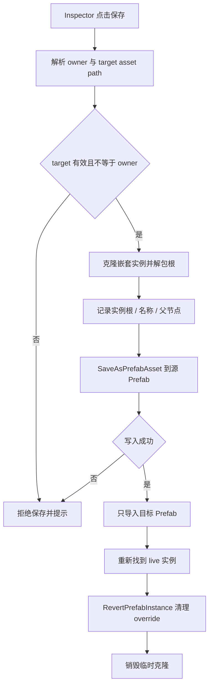

# Ultimate Skill Camera Timeline Generator 开发经验沉淀

> 本文记录 `UltimateSkillCameraTimelineGenerator` 在 Prefab 保存、嵌套 Prefab、本地预设、Odin 工具界面和验证过程中的工程经验。后续开发 Unity Editor 工具、Timeline 生成器或 Prefab 批量编辑器时，可把本文当作排查与实现参考。

## 先看结论

这类工具最容易出问题的不是“生成文件”，而是**资产边界不清**：

- 当前操作的是主 Timeline Prefab，还是嵌套在它里面的子 Prefab。
- 当前修改只应落盘到哪一个源 Prefab。
- 保存后，原实例上的 override 是否要保留、同步或清理。
- 工具参数应该写进 `Assets/`，还是只留在本机 `Library/` 或 `EditorPrefs`。

处理顺序应当是：先确定资产归属与写入边界，再设计保存 API，最后做界面和批量功能。反过来先堆按钮、后补边界，通常会把外层 Prefab 误删、误覆盖或生成两份内容。

## 工具背景

入口：`TA_Tools/Animation/技能大招资产生成器`

主要代码：

| 文件 | 职责 |
| --- | --- |
| `UltimateSkillCameraTimelineGeneratorWindow.cs` | 大招模式生成、Timeline / Prefab 组装、通用收集与校验 |
| `UltimateSkillCameraTimelineGeneratorWindow.UI.cs` | Odin 窗口布局、模式切换、生成按钮 |
| `UltimateSkillCameraTimelineGeneratorWindow.Presentation.cs` | 剧情过场、抽卡角色表演生成 |
| `UltimateSkillCameraTimelineGeneratorWindow.Validation.cs` | 生成前校验与生成后自检 |
| `UltimateSkillCameraTimelineGeneratorWindow.Presets.cs` | 本地预设快照、保存、加载、删除 |
| `UltimateTimelineBindingsEditor.cs` | 场景预览绑定、嵌套 FX 保存到源 Prefab |

工具同时处理主 Timeline、主 Prefab、ID 镜头 Prefab、FX Prefab、动画 Clip、AudioClip、道具 Prefab 和场景对象。它不是一个只改字段的 Inspector，而是典型的**多资产编辑器**。

## 经验一：先定义资产边界

### 主 Prefab 与嵌套 Prefab 不是同一种对象

在 Prefab Mode 外面看到的是主 Timeline Prefab 实例。`fx_group` 下的 FX、`prop_group` 下的道具、`camAni_group` 下的镜头，往往又是嵌套 Prefab 实例。

同一套修改逻辑不能无脑复用：

| 操作目标 | 应写入的资产 | 不能写入的资产 |
| --- | --- | --- |
| 主 Timeline 结构、主 Prefab 层级 | 主 Timeline `.playable` + 主 Prefab `.prefab` | 嵌套 FX / 镜头 / 道具源 Prefab |
| `fx_group` 中某个 FX 的改动 | 该 FX 的源 `.prefab` | 外层主 Timeline Prefab |
| 配置了动画的道具 | 该道具源 `.prefab`（仅补 Animator 时） | 主 Prefab、其它道具 |
| 预览绑定 | 当前场景实例 | 主 Prefab 资产 |

### 实践规则

1. 写资产前先解析 owner asset path 与 target asset path。
2. target 与 owner 相同时，拒绝写入或要求调用方明确说明。
3. 不允许无校验地使用 `SaveAsPrefabAsset` 覆盖未知路径。
4. 嵌套 Prefab 的源解析优先用 `GetPrefabAssetPathOfNearestInstanceRoot`，必要时回退到 `GetCorrespondingObjectFromOriginalSource`。
5. 单独保存嵌套 Prefab 时，不调用会顺手保存其它 Dirty 资产的全局保存 API。

## 经验二：嵌套 Prefab 保存要分三段

### 问题现象

在主 Timeline 实例上直接保存嵌套 FX 时，容易出现：

- `GetCorrespondingObjectFromSource` 返回 `null` 或返回外层对象，触发 `ArgumentNullException`。
- 改写到了外层 Timeline Prefab，导致主 Prefab 内容丢失或结构被替换。
- 源 Prefab 保存了，但原实例还保留一份 override，Hierarchy 里看起来有两份。
- 保存一个嵌套 Prefab 后，其它对象引用失效，后续写入建立在失效引用上。

### 解决方案

采用 **快照 -> 写源资产 -> 清理实例覆盖** 三段式。

#### 第一段：先做快照

在写任何资产前，先把要保存的实例克隆出来，并记录恢复所需信息：

- 克隆的 `GameObject`
- 原嵌套实例根
- 目标源 Prefab 路径
- 实例名称
- 原父节点

关键点：

- `SaveAsPrefabAsset` 接收的必须是普通根对象，不能是仍指向待覆盖资产的 Prefab 实例根。
- 克隆根如果仍属于 Prefab 实例，要通过 `UnpackPrefabInstance(..., PrefabUnpackMode.OutermostRoot, ...)` 解掉关联，避免保存时形成自引用。
- 所有子对象引用要在导入前抓完。导入资产会让原本的 live hierarchy 引用失效。

#### 第二段：只写源 Prefab

保存时：

1. 解析并校验目标 `.prefab`。
2. 拒绝目标指向主 Timeline Prefab。
3. 调用 `SaveAsPrefabAsset(clone, assetPath, out bool success)`。
4. 失败时把 Unity 的返回值当失败处理，不能只看是否抛异常。

#### 第三段：同步导入并清理 override

源资产保存后：

1. 只对目标源 Prefab 调用 `AssetDatabase.ImportAsset(..., ForceSynchronousImport | ForceUpdate)`。
2. 不做全局 `AssetDatabase.SaveAssets()`，避免把外层 Prefab 和其它 Dirty 资产一并写盘。
3. 重新解析原 live 嵌套实例。
4. 对 live 实例执行 `PrefabUtility.RevertPrefabInstance`，让新源 Prefab 成为基准，清掉旧实例新增子节点和属性 override，避免 Hierarchy 中两份相同内容。

### 流程



## 经验三：不要把“实例修改”和“源 Prefab 保存”混为一谈

Prefab 实例上的改动有两种状态：

- 已保存进源 Prefab：所有实例共享。
- 仍是实例 override：只属于当前实例，容易和源内容重复。

如果工具的目标是“保存到源 Prefab”，保存后原实例就不应该继续显示旧 override。否则会出现：

```text
源 Prefab 已包含新节点
原实例仍然保留同样的 AddedGameObject override
Hierarchy 中看到两份一模一样的内容
```

因此 `RevertPrefabInstance` 不是可选的“美化步骤”，而是保存语义的一部分。

## 经验四：道具动画与 Animator 的边界

当道具配置了动画时，Timeline 的 `AnimationTrack` 需要一个 Animator 绑定目标。工具采取的规则是：

- 未配置动画：完全不处理该道具 Prefab。
- 配置动画且整棵 Prefab 都没有 Animator：自动补一个无 Controller 的 Animator。
- 已经有 Animator：只复用，不重写源 Prefab。

实现细节：

- 使用 `PrefabUtility.LoadPrefabContents` 打开源 Prefab。
- 用 `GetComponentInChildren<Animator>(true)` 检查整棵层级，避免子节点已有 Animator 时又在根节点加第二个。
- 只有真的新增组件时才调用 `SaveAsPrefabAsset`。
- 在 `finally` 中调用 `UnloadPrefabContents`。

这条规则可以推广为：

> 工具只在“没有可用组件且该组件是功能必需”时补组件；不要借生成流程顺手补无关组件。

## 经验五：本地预设的目标是复用参数，不是保存资产

### 设计原则

预设应保存“打开工具后要继续编辑的参数”，不应保存生成结果，也不应污染工程资产。

本项目采用：

| 内容 | 存储位置 |
| --- | --- |
| 预设文件 | `Library/TA_Tools/UltimateSkillCameraTimelineGenerator/Presets/*.json` |
| 上次使用的预设名 | `EditorPrefs` |
| 工具运行时参数 | 窗口自身的 `[SerializeField]` 字段 |
| 生成结果 | `Assets/` 下的 Timeline / Prefab / Clip |

放在 `Library/` 的原因是：

- 不进入 `Assets/`，不会被打包。
- 不产生 `.meta`，不污染版本库。
- 每台机器可以有不同预设。
- 工具重开、Unity 重启后仍可复用。

### 实现方式

#### 1. 用 SerializedObject 做通用快照

不要为每个字段手写 Save/Load。字段一多，增删字段就会漏。

当前实现从窗口根属性开始：

```csharp
_productionMode
_settings
_storySettings
_gachaSettings
```

用 `SerializedObject` + `SerializedProperty` 递归捕获：

- 基础类型：int、enum、bool、float、string 直接写字符串。
- 数组：记录 array size，再递归记录每个元素。
- Generic：递归记录子属性。
- ObjectReference：记录 Asset GUID 与 localFileId，而不是只存路径。

#### 2. 资源引用用 GUID + localFileId

只保存路径会出问题：

- 资源被移动后路径失效。
- FBX 内的子资源用路径无法唯一定位。

保存时：

```csharp
AssetDatabase.GetAssetPath(value)
AssetDatabase.TryGetGUIDAndLocalFileIdentifier(value, out guid, out localFileId)
```

加载时：

- 先用 GUID 反查资源路径。
- 再按 localFileId 在 `LoadAllAssetsAtPath` 结果中找到对应子资源。
- 找不到时回退到主资源并记录 MissingAssets，不要中断整个预设加载。

#### 3. Snapshot 结构

```json
{
  "schemaVersion": 1,
  "properties": [
    {
      "path": "_settings.heroId",
      "propertyType": 4,
      "isArray": false,
      "value": "100601"
    }
  ]
}
```

增加 `schemaVersion` 后，以后字段结构不兼容时可以拒绝旧预设并提示重新保存。

#### 4. 加载策略

加载预设时：

1. `serializedObject.Update()`。
2. 按保存的 property path 查找当前字段。
3. 找得到就写回。
4. 找不到就记入 `MissingProperties`，继续加载其它字段。
5. `ApplyModifiedPropertiesWithoutUndo()`。
6. 重新执行 `EnsureSettingsDefaults` 和模式默认值补齐。

这样字段增删不会让整个预设报废，旧预设仍能尽量恢复。

#### 5. 默认预设名

预设名为空时动态生成：

| 模式 | 默认名 |
| --- | --- |
| 大招技能 | `<角色编号>_<技能名称>` |
| 剧情过场 | 演出名称 |
| 抽卡角色表演 | 角色编号 |

只有在用户手动保存或加载过具体预设后，才固定 `_presetName`。这样默认名会跟当前配置联动，又不会在改参数时误覆盖已保存预设。

#### 6. 文件名校验

预设名直接参与文件名，因此必须处理：

- 空字符串
- 非法文件名字符
- 结尾点号
- `.` 与 `..`

当前策略是把非法字符替换为 `_`，再拒绝无效结果。

## 经验六：Odin 界面要服务操作流

### 同组操作放同一行

预设区把四个操作放同一水平组：

```csharp
[HorizontalGroup(PresetRootGroup + "/预设操作", Width = 0.25f)]
```

保存、加载、删除、打开目录属于同一组操作，横向排列能减少纵向滚动和误点。

### 名称字段与加载入口放一起

预设名使用 `ValueDropdown` 显示现有预设，同时配 `InlineButton` 提供快速加载。这样用户既能选已有名字，也能直接点加载。

### 窗口状态用 SerializeField

工具参数使用 `[SerializeField]`，脚本重编译后仍保留。临时状态、提示信息则用普通字段，不必全部落盘。

### 复杂窗口仍优先 OdinEditorWindow

本项目工具使用 `OdinEditorWindow`，原因是需要：

- 折叠分组
- 水平按钮组
- 动态显示/隐藏
- 颜色
- 列表拖动
- 自定义字段标签

如果只是单次批处理，不要为了统一风格强上 Odin。

## 经验七：生成器必须区分生成、组装和保存

工具中的行为分为：

| 操作 | 作用 |
| --- | --- |
| 只生成 | 生成模块资源，不动主 Timeline |
| 组装 | 只把某模块重组进已有主 Timeline / Prefab |
| 生成并组装全部 | 从输入到主资产完整执行 |
| 保存到源 Prefab | 只保存嵌套子 Prefab，不保存外层 |

这种拆分让美术能局部重做，不会因为只改一个 FX 就重建全部资源。

实现时要注意：

- 每个 Scope 只处理自己负责的模块。
- 局部组装不能清空其它模块或美术手动内容。
- 保存嵌套 Prefab 不能顺手保存外层 Prefab。
- 生成失败时保留原资产，不要先删后建。

## 经验八：覆盖更新要保留 GUID

Timeline、Prefab、FX、PostProcess 等资产被引用后，路径和 GUID 都是外部契约。

优先做法：

1. 已存在资源按原路径更新。
2. Prefab 用 `LoadPrefabContents` 修改后写回原路径。
3. 不新建“同名新文件”再替换。
4. 不主动删美术新增的非工具轨道和节点。
5. 只清理工具自己拥有和可识别的节点。

主 Prefab 中工具独占节点的清空再回填，可以避免重复生成越堆越多；非工具节点保持不动。

## 经验九：两遍保存解决 ExposedReference

Timeline 的 ExposedReference 依赖对象 fileID。新对象刚生成时 fileID 还不稳定，第一遍直接写引用容易丢失。

采用两遍保存：

1. 第一遍创建完整层级并保存，让新对象拿到稳定 fileID。
2. 第二遍重新 `LoadPrefabContents`，再写 ExposedReference，再保存。

第二遍不要再重新设置 PlayableAsset，也不要无意义 `RebuildGraph`，否则可能把引用表冲掉。

取引用名时必须读序列化字段，不能依赖 `PropertyName.ToString()`。后者会带内部 id，不适用于名称比较。

## 经验十：验证要覆盖静态、资产和运行时

不同层级的验证不能互相替代。

| 层级 | 能验证什么 | 不能证明什么 |
| --- | --- | --- |
| 编译检查 | 类型、API、语法 | Prefab 保存结果 |
| 批处理 / SmokeTest | 生成流程、资产结构、引用写盘 | 动画观感、相机表现 |
| Unity 内生成 | Prefab、Timeline、绑定、层级 | 最终战斗表现 |
| 场景 / Play Mode | 播放、镜头、特效、音效、道具 | 其它平台或其它角色资源 |

### 编译检查

Unity 运行时可使用 Bee 的真实 `Assembly-CSharp-Editor.rsp`，复制到临时目录后替换输出路径，再用 Unity 自带 Roslyn 执行。这样比仅做文本检查更接近真实编译环境。

### Prefab 专项验证

至少检查：

- 配置动画的道具源 Prefab 是否出现且只出现一个 Animator。
- 未配置动画的道具是否完全没变。
- 保存嵌套 FX 后，外层 Timeline Prefab 是否未被改动。
- 原实例 override 是否已清理，Hierarchy 中是否只有一份。
- 源 Prefab 的 `.meta` GUID 是否保持不变。

### 预设专项验证

至少检查：

- 保存后 `Library/.../Presets/*.json` 是否生成。
- 关闭并重开窗口后是否自动加载上次预设。
- 资源移动或删除后，预设加载是否仍能完成并给出缺失提示。
- 预设名默认值是否随角色编号和技能名变化。
- 多个预设之间切换是否覆盖正确字段。
- 预设文件是否没有进入 `Assets/`。

## 常见坑与处理

| 问题 | 根因 | 处理 |
| --- | --- | --- |
| `GetCorrespondingObjectFromSource` 行为异常或返回 null | 嵌套层级下取到的不是最近 Prefab 根 | 先取 nearest instance root，必要时回退 original source |
| 保存嵌套 FX 后主 Prefab 丢失 | target path 解析成外层 Prefab | 写前比较 target 与 owner，相同则拒绝 |
| Hierarchy 中出现两份内容 | 源 Prefab 已保存，原实例 override 未清 | 保存后 `RevertPrefabInstance` |
| 保存一个子 Prefab 影响其它修改 | 使用了全局 SaveAssets | 只 Import 目标资产 |
| 资源移动后预设引用失效 | 只保存了路径 | 存 GUID + localFileId |
| 道具子节点已有 Animator 却又补一个 | 只检查根节点 | 用 `GetComponentInChildren<Animator>(true)` |
| 配置动画前的普通道具也被改 | 生成前未按动画列表过滤 | 只有 animations 非空才处理 |
| 按钮太多导致界面过长 | 每个按钮单独一行 | 同组操作使用 HorizontalGroup |
| 预设默认名不跟随配置 | 把默认名直接写进序列化字段 | 空值动态计算，手动命名后再固定 |
| 字段增删导致旧预设无法用 | 强绑定旧结构 | 按 property path 容错加载并报告缺失字段 |

## 可直接复用的实现模板

### 1. 本地预设存放

```text
<ProjectRoot>/Library/TA_Tools/<ToolName>/Presets/*.json
EditorPrefs key: <Company>.<Namespace>.<ToolName>.LastPreset
```

### 2. 预设快照

```csharp
PresetSnapshot
  schemaVersion
  properties[]

PresetPropertySnapshot
  path
  propertyType
  isArray
  arraySize
  value
  objectGuid
  objectLocalFileId
  objectAssetPath
  children[]
```

### 3. 保存流程

```text
校验名称
  -> CapturePresetSnapshot
  -> Directory.CreateDirectory
  -> File.WriteAllText(json)
  -> EditorPrefs.SetString(lastPreset)
```

### 4. 加载流程

```text
读取 JSON
  -> 校验 schemaVersion
  -> ApplyPresetSnapshot
  -> 缺失字段 / 缺失资源生成提示
  -> 补齐工具默认值
  -> EditorPrefs.SetString(lastPreset)
```

### 5. 嵌套 Prefab 保存流程

```text
解析最近嵌套根与源路径
  -> 拒绝 owner 路径
  -> 克隆实例并解包根
  -> 保存到源 Prefab
  -> 只导入目标资产
  -> 找回 live 实例
  -> RevertPrefabInstance
  -> 销毁临时克隆
```

## 设计清单

开发同类工具前逐项确认：

- [ ] 每个写入操作的目标资产路径是什么？
- [ ] 会不会影响外层 Prefab 或其它 Dirty 资产？
- [ ] 资源保存后需要保留、同步还是清理实例 override？
- [ ] 已存在资源是否按原路径更新并保留 GUID？
- [ ] 工具新增组件是否只在功能必需时发生？
- [ ] 工具节点与美术手动节点的边界是否明确？
- [ ] 参数保存是否不进入 `Assets/`？
- [ ] 预设中的资源引用是否使用 GUID + localFileId？
- [ ] 字段增删后旧预设是否可以容错加载？
- [ ] 界面操作是否分组清晰、避免误点？
- [ ] 静态编译、批处理和 Unity 内验证是否都安排了？

## 一句话总结

多资产 Editor 工具的核心不是“把文件写出来”，而是**准确控制修改属于哪个资产、保存到什么路径、保存后如何同步实例状态**；本地预设则是把可复用参数与工程资产生命周期彻底分离。
