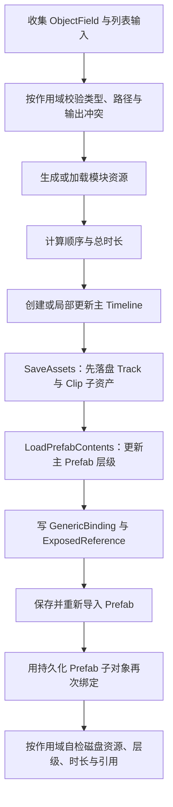

# Unity Timeline 资产生成、Prefab 绑定与增量组装参考

> 类型：`REFERENCE`；适用范围：用 Unity Editor 工具批量生成或更新 Timeline、Prefab、AnimationClip、Cinemachine 镜头、音效、道具与特效基础结构；使用前提：必须以目标项目的 Unity/Timeline/Cinemachine 版本、Track/Clip 类型、Prefab 层级和资源序列化结果重新验证。
>
> 关联规则：`TOOL-CMP-01`、`TOOL-ARC-01`、`TOOL-OPS-01`、`TOOL-OPS-02`、`TOOL-VAL-02`、`TML-CMP-01`、`TML-ARC-01`、`TML-ARC-02`、`TML-VAL-01`。模块入口见 [TA 工具开发规则](../../ToolDevelopment/README_Tech_TAToolDevelopmentRules.md) 与 [Timeline 开发规则](../README_Tech_TimelineDevelopmentRules.md)；对象查找与挂点解析见 [Timeline 目标解析与嵌套挂点跟随参考](timeline-object-attachment-resolution.md)；ProjectACG 的实际实现见 [大招 Timeline 生成器 Profile](../../ToolDevelopment/Profiles/ProjectACG/ultimate-skill-timeline-generator.md)。

这类工具的难点不是“创建几个资源”，而是让列表顺序、资源更新、Timeline 子资产、Prefab 内场景对象和 `PlayableDirector` 绑定在重复生成后仍保持一致。推荐把“模块资源生成”和“组装到主 Timeline/Prefab”拆开，并为工具自动维护的区域建立清晰所有权。

## 1. 适用场景

- 一个主 Timeline 需要按列表顺序组装多个动作、镜头、道具、音效或特效。
- 镜头 FBX 需要转换为独立 AnimationClip、镜头层级 Prefab 和 Cinemachine Shot。
- Timeline Clip 需要引用主 Prefab 内的对象，而不是 Project 中的 Prefab 资源。
- 已有主 Timeline/Prefab 要按原路径更新，并保留 GUID、人工内容或未参与本次操作的模块。
- 美术需要“只生成模块资源”和“只组装某个模块”两套独立操作。
- 生成后出现 `Animator` 缺失、`Virtual Camera` 为空、Prop 场景目标丢失、FX `Source Game Object` 为空或 FOV 不播放。

本参考不替代单个工具自己的 Art/Tech README，也不定义项目固定路径、文件名、Track 名、第三方 Track 类型或 Prefab 层级。

## 2. 前提与依赖

### 2.1 先冻结四类合同

实现前先形成一张合同表，避免在 UI、生成逻辑和自检中分别推导规则。

| 合同 | 需要明确的内容 | 常见失误 |
| --- | --- | --- |
| 输入合同 | 用户拖入什么对象、空项如何处理、列表顺序是否有语义。 | UI 包装类型过多，或执行层重新排序。 |
| 输出合同 | 路径、文件名、目录、覆盖策略、是否生成 `.meta`、旧产物如何处理。 | 根据源文件名直接拼输出，导致不稳定或冲突。 |
| 组装合同 | 根轨顺序、子轨结构、Clip 起点/长度、Prefab 节点、绑定对象类型。 | 只创建 Track/Clip，没有落盘场景引用。 |
| 所有权合同 | 哪些轨道/节点由工具独占，哪些内容由美术维护，重复生成时保留什么。 | 全量清空 Prefab/Timeline，或什么都不清导致重复堆积。 |

### 2.2 用上下文模型统一列表顺序

输入列表先转换成无 UI 依赖的生成上下文，例如：

```csharp
sealed class GenerationContext
{
    public readonly List<CharacterArtifact> Characters = new();
    public readonly List<CameraArtifact> Cameras = new();
    public readonly List<GameObject> Props = new();
    public readonly List<AudioClip> Sounds = new();
    public readonly List<GameObject> Effects = new();
    public double Duration;
}
```

上下文中的顺序就是最终 Timeline 顺序。空项可以统一跳过，但“校验、生成、组装、自检”必须调用同一套 `HasSource` 判定；否则 UI 看似接受空项，后续计数却会错位。

### 2.3 把生成作用域做成显式状态

推荐至少区分：

- 完整生成并组装；
- 单模块资源生成；
- 单模块组装；
- 只用已有资源完整组装。

作用域不是 UI 文案，而是验证、覆盖询问、资源加载、写入范围和生成后自检的共同输入。单模块组装不应因为其它列表为空、旧资源数量不同或其它模块仍由美术维护而失败。

## 3. 实现或排查步骤

### 3.1 采用“生成资源 → 保存 Timeline → 保存 Prefab → 持久对象重绑 → 自检”的顺序

推荐流程如下：



先保存 Timeline 的原因是 `CreateClip<T>()` 会创建 Timeline 子资产；主 Prefab 的 `PlayableDirector` 在这些 Track/Clip 尚未落盘时绑定，可能读到旧对象或未注册的引用名。

### 3.2 模块资源生成与主资源组装分离

模块生成只负责模块自身资产；组装只消费已存在的模块资产并更新主 Timeline/Prefab。两者分离后可以支持：

- DCC 资产到齐时先批量生成；
- 美术手改特效、道具或主 Prefab 后，只重组某个模块；
- 镜头重新导出时只更新镜头动画和镜头层级；
- 音效、道具直接引用现有资产时，不制造没有意义的复制件或目录。

“只生成”按钮若对应模块没有独立输出（例如只引用现成 Prefab/AudioClip），应明确提示“没有额外资源需要生成，请使用组装”，不能假装成功生成了文件。

### 3.3 完整重建与增量组装使用不同更新策略

| 模式 | 推荐行为 | 需要保护的内容 |
| --- | --- | --- |
| 完整组装 | 按固定顺序重建工具拥有的根轨和固定层级。 | 明确捕获并恢复允许保留的人工 Clip/绑定。 |
| 镜头组装 | 只更新 Camera Group、镜头动画节点和工具生成的虚拟相机。 | 道具、音效、特效节点与轨道。 |
| 道具组装 | 只替换道具 Track 的 Clip 和 Prefab 道具容器。 | 镜头、音效、特效及其它人工节点。 |
| 音效组装 | 只替换 AudioTrack 的 Clip。 | 主 Prefab 层级和其它轨道。 |
| 特效组装 | 只替换 FX Track 和 Prefab 特效容器。 | 镜头、道具、音效及其它人工节点。 |

增量组装时先按稳定名称或类型找到现有目标轨道，再删除该轨道上的工具 Clip；不要为了更新一条轨道调用“删除所有根轨”的完整重建函数。目标结构不存在时可以回退到完整组装，但 UI、日志和文档要说明这次回退会扩大写入范围。

### 3.4 原路径更新，不做 delete-then-create

更新已有 `TimelineAsset`、Prefab、AnimationClip、VolumeProfile 等资源时，优先加载原路径并在原对象上更新。这样更容易保留 `.meta` 与 GUID，也能降低引用断裂风险。

资源不存在时才创建；不再需要的历史派生产物要按明确清单清理，不能根据模糊前缀批量删除。清理旧产物属于兼容迁移，应在工具 README 和结果日志中说明。

### 3.5 给工具维护的层级设置独占容器

主 Prefab 推荐把自动内容放在稳定容器下，例如 `CameraAnimation`、`VirtualCameras`、`Effects`、`Props`。重复组装时只清空对应容器，不清空主 Prefab 根节点。

实例化应使用 `PrefabUtility.InstantiatePrefab(prefab, contents.scene)`，再设置父级和本地变换。直接 `Object.Instantiate` 虽然能得到层级，但容易丢失 Prefab 实例关系，也不利于后续追踪来源。

### 3.6 Timeline 绑定必须指向主 Prefab 内的持久对象

Timeline 中常见两类绑定：

| 绑定类型 | API | 目标示例 |
| --- | --- | --- |
| Track Binding | `PlayableDirector.SetGenericBinding(track, target)` | AnimationTrack → `Animator`。 |
| Clip `ExposedReference` | `PlayableDirector.SetReferenceValue(propertyName, target)` | Cinemachine Shot → 虚拟相机；挂点 Clip → 道具实例；Control Clip → 特效实例。 |

关键点是 `target` 必须属于最终保存的主 Prefab，而不是 Project 中的源 Prefab，也不是已经销毁的 PrefabContents 临时对象。

推荐为每个 Clip 生成稳定且唯一的引用名：

```text
<owner>_<module>_<NN>
```

创建 Clip 时写 `exposedName`，保存主 Prefab 时再用同一个 `PropertyName` 回填实际对象。不要把项目 Prefab 填到 `defaultValue` 来掩盖场景引用为空，因为这样会绕过“主 Prefab 内实例”这一合同。

### 3.7 不要用 `PropertyName.ToString()` 比较 ExposedReference 名称

`PropertyName.ToString()` 可能包含内部 ID，结果并不等于序列化字段中的纯引用名。需要匹配已生成 Clip 时，使用 `SerializedObject` 读取 `ExposedReference` 内的 `exposedName` 字段，或在创建时把引用名保存到明确的数据结构中。

典型症状是：Clip 明明存在，生成器却找不到它；随后绑定阶段跳过，Timeline Inspector 显示 `None`。

### 3.8 Prefab 保存后再做一次持久对象绑定

在 `LoadPrefabContents` 场景中写入引用后直接 `SaveAsPrefabAsset`，Unity 需要把临时场景对象重映射为 Prefab 资产子对象。复杂 `PlayableDirector` 引用表在这一阶段可能丢失。

稳妥流程是：

1. 第一次保存主 Prefab 的层级和组件；
2. 强制导入目标 Prefab；
3. 再次 `LoadPrefabContents`；
4. 从已落盘层级重新查找虚拟相机、道具和特效实例；
5. 重写 Generic Binding 与 ExposedReference；
6. 保存、卸载、`SaveAssets`；
7. 重新加载 Prefab 资产并逐项读取验证。

必要时可通过 `SerializedObject` 同步 `PlayableDirector.m_PlayableAsset` 和 `m_SceneBindings`，但字段名属于 Unity 版本实现细节，必须由项目 Profile 锁定并在目标版本验证。

### 3.9 Animator 的位置由动画目标决定

Timeline `AnimationTrack` 需要绑定 `Animator`，但不代表模块 Prefab 必须自带 Animator Controller。对于“纯镜头层级 Prefab”：

- 模块 Prefab 可以不带 `Animator`、Controller、`Camera` 或子 Timeline；
- 实例化到主 Prefab 后，在实际被 Timeline 驱动的根对象上补空 `Animator`；
- `runtimeAnimatorController` 留空，由 Timeline Clip 直接驱动 AnimationClip；
- 获取 Animator 后再访问属性，不能假设 `GetComponent<Animator>()` 一定非空。

这样能避免状态机与 Timeline 同时写同一组 Transform 曲线。

### 3.10 移除被动画曲线指向的组件时，要迁移曲线语义

DCC 相机动画通常把 FOV 曲线绑定到 `Camera.field of view`。如果运行时结构移除了 `Camera` 组件，位置/旋转仍会播放，但 FOV 会静默失效。

解决思路不是把不需要的 Camera 加回来，而是把曲线转换到实际消费者，例如 Cinemachine 虚拟相机的 Lens FOV，并创建一条绑定到该虚拟相机 Animator 的独立 FOV AnimationTrack。转换后同时检查：

- 属性路径、组件类型和字段名正确；
- 原曲线关键帧与切线被保留；
- FOV Track 与镜头 Transform Track 使用相同起点和长度；
- FOV Track 绑定的是虚拟相机上的 Animator，而不是镜头层级 Animator；
- 无 FOV 曲线的镜头不生成空 FOV Track。

这一模式也适用于“源动画指向旧组件，但最终运行结构由代理组件消费”的其它情况。

### 3.11 镜头 Transform 与 Cinemachine Shot 共用时间区间

对每个镜头先计算一个 `{ start, duration }`，再让镜头 Transform AnimationTrack、可选 FOV Track 和 Cinemachine Shot 复用该区间。不要分别累加三遍，否则浮点误差或空项跳过会造成切镜与动画错位。

多动作与多镜头可以分别按各自列表连续排列，不必强制一一配对；是否对齐由具体技能合同决定。总时长通常优先取角色动作总长度，无动作时才回退到镜头总长度。铺满型模块（道具、音效、特效）的 Clip 使用同一个总时长来源。

### 3.12 自检应读取生成结果，不只检查内存对象

生成后自检至少覆盖：

- 文件是否存在且类型正确；
- Timeline 根轨顺序、子轨数量和 Clip 数量；
- Clip 起点、长度和源资产；
- 主 Prefab 固定容器和实例数量；
- `PlayableDirector.playableAsset`；
- Generic Binding 是否指向正确 Animator；
- ExposedReference 是否解析到主 Prefab 内正确子对象；
- Cinemachine Body/Aim、Follow/LookAt 和 Lens；
- 旧产物是否清理；
- 同路径更新后 `.meta`/GUID 是否保持。

自检必须按作用域执行。点“音效组装”时只校验音效与主结构，不应强制当前 UI 中的镜头、道具、特效列表与磁盘现状完全一致。

## 4. 常见问题与解决方式

| 现象 | 常见根因 | 解决方向 |
| --- | --- | --- |
| `There is no Animator attached` | 代码先访问 Animator，再决定是否补组件。 | `GetComponent` 后立即判空并 `AddComponent<Animator>()`；绑定前再校验。 |
| Cinemachine Shot 的 Virtual Camera 为 `None` | Clip 引用名不一致，或绑定的是保存前临时对象。 | 统一引用名；Prefab 落盘后用持久子对象二次绑定并回读。 |
| Prop Clip 的场景目标丢失 | 绑定到 Project Prefab 或 PrefabContents 临时实例。 | 绑定最终主 Prefab 的 Prop 容器子对象。 |
| FX 的 `Source Game Object` 丢失 | `ControlPlayableAsset` 仍配置为运行时实例化 Prefab，或 Parent Object 没回填。 | `prefabGameObject = null`；`sourceGameObject` 指向主 Prefab 内 FX 实例。 |
| 能播放相机位移旋转，FOV 不动 | FOV 曲线仍指向已移除的 `Camera`。 | 将曲线迁移到实际 Lens 消费者并使用独立绑定轨。 |
| 重复生成后手工内容丢失 | 工具没有声明所有权，完整清空 Timeline/Prefab。 | 使用独占容器和模块级更新；完整重建前捕获允许保留的人工内容。 |
| 重复生成后节点越来越多 | 未清理工具拥有的旧实例，或按数量而非稳定键匹配。 | 只清理对应独占容器，再按当前上下文重建。 |
| 找不到刚创建的 Clip | Timeline 子资产尚未保存，或用 `PropertyName.ToString()` 比较名称。 | Timeline 先 `SaveAssets`；读取纯 `exposedName`。 |
| 单模块组装被其它模块报错拦截 | 验证和自检仍按完整生成执行。 | 让输入校验、输出检测和结果自检都消费同一作用域。 |
| 美术不敢使用工具 | UI 暴露了中间产物、包装类型、路径字符串和工程内部设置。 | ObjectField + 直接资源列表；高级项折叠；按钮按工作流成对排列。 |
| 源资源命名不合规就完全无法生成 | 把命名规范误当成资源有效性。 | 输出名由稳定规则生成；源名只作可选编号提示，冲突仍阻断。 |

## 5. 风险与不适用边界

| 边界 | 说明 |
| --- | --- |
| Unity 私有序列化字段 | `m_PlayableAsset`、`m_SceneBindings` 等字段可能随版本变化，只能在明确版本 Profile 中使用并实测。 |
| Prefab 人工内容 | “更新已有 Prefab”不等于自动保留一切；只能保证所有权合同内声明的区域。未知节点需要快照/恢复或人工回退。 |
| 完整重建 | 即使单模块组装安全，完整组装仍可能重建全部工具轨道；必须单独验证人工轨道、Marker 和绑定是否保留。 |
| 外部 Track 类型 | 自定义挂点 Track、特效 Track 的字段名、默认挂点和恢复语义属于项目事实，不能从本参考推断。 |
| Cinemachine 版本 | Body/Aim 组件类型、Lens 字段和 Shot API 可能变化，升级包版本后要重新验证。 |
| FOV 曲线 | 只迁移字段名不足以保证视觉一致；还需确认传感器、Gate Fit、焦距换算和纵横比合同。 |
| Undo | AssetDatabase、Prefab 保存和 Timeline 子资产写入通常不具备完整 Undo；回滚主要依赖版本管理、备份或重新生成。 |
| CLI 编译 | `dotnet build` 只能证明当前 csproj 快照可编译，不能证明 Unity 导入、Timeline 播放和 Prefab 引用落盘正确。 |

## 6. 验证与回退

### 6.1 最小验证矩阵

| 层级 | 检查 | 通过条件 |
| --- | --- | --- |
| 输入 | 空列表、空行、错误类型、无效目录、重复输出名。 | 错误在写入前出现；空行按合同跳过。 |
| 多项顺序 | 多动作、多镜头、列表拖拽重排。 | Timeline 顺序与列表一致，起点连续且无重叠/空洞。 |
| 重复生成 | 同一配置执行两次。 | 不重复堆节点；原路径、GUID 和绑定稳定。 |
| 单模块组装 | 分别组装镜头、道具、音效、特效。 | 只更新目标模块，其它轨道和容器不变。 |
| 绑定 | 保存、关闭、重新打开主 Prefab。 | Shot、Prop、FX 和 AnimationTrack 绑定仍指向 Prefab 内对象。 |
| 镜头 | Transform、FOV、切镜、Seek、Pause、Stop。 | 三类曲线时间一致，停止/重播无错误状态。 |
| 人工内容 | 添加一个工具范围外的手工 Clip/节点后重组。 | 按所有权合同保留；无法保留时提前警告并可回退。 |
| 失败恢复 | 中途抛异常、目标只读、资源缺失。 | 输出明确失败项；现有资产不被部分清空或伪报成功。 |

### 6.2 调试顺序

出现 `None` 或绑定无效时，按以下顺序排查：

1. Timeline Clip 上是否真的存在正确 `exposedName`；
2. `PlayableDirector.playableAsset` 是否指向当前 Timeline；
3. 目标对象是否属于最终主 Prefab，而不是源资源或临时场景；
4. `GetReferenceValue` 的 `valid` 与返回对象是否正确；
5. Prefab 保存、重新导入和重新加载后结果是否仍存在；
6. Prefab 文本序列化中的 `m_ExposedReferences` 是否包含预期键；
7. 作用域自检是否误把未参与模块当成失败。

### 6.3 回退策略

- 单模块更新失败时，不继续执行完整重建；保留原主资源并报告缺失条件。
- 需要完整重建时先由版本管理或备份保护主 Timeline/Prefab。
- 新绑定方案不稳定时，回退到显式 Track Binding 或由美术手动设置的稳定引用，不用名称猜测替代。
- FOV 转换不确定时保留源曲线副本，并在代表性镜头中对拍 DCC 与 Unity 结果。

### 6.4 交付记录

交付时分别记录：静态检查、Editor 程序集编译、Unity 资源生成、Prefab 重开、Timeline 播放、Cinemachine/FOV 视觉验证，以及尚未完成的项目。不要把“代码编译通过”写成“生成资产与播放效果已验证”。
