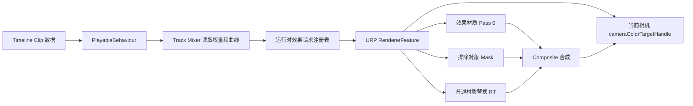

# Timeline 自定义后处理与 RendererFeature 参考

> 类型：跨项目 `REFERENCE`，不是项目 `PROFILE`，不新增 CORE 强制规则。
>
> 适用范围：Timeline 驱动的屏幕空间后处理，以及需要排除场景对象、临时替换普通材质的 URP RendererFeature。
>
> 使用前提：必须按目标项目的 Unity、URP、Timeline 版本、渲染器配置和现有资源重新验证。本文案例来自 Unity 2022.3、URP 14、Timeline 1.7 的实现经验，具体 API 和执行时序不能直接套用到其他版本。

## 1. 先记住的结论

1. **Timeline 不应直接绑定某一台 Camera。** 后处理属于当前 Renderer 执行的相机级状态，Pass 在执行时使用当前相机的 `cameraColorTargetHandle`。Timeline 只负责注册当前帧的效果请求。
2. **Track/Clip/Mixer、RendererFeature 和 Shader 是一条完整链路。** Inspector 能看到参数，只能证明序列化字段存在，不能证明效果已经进入正确相机、Pass、材质和合成阶段。
3. **场景对象引用不能直接依赖 Timeline 资产保存。** 需要从 Hierarchy 选择对象时，使用 `ExposedReference<GameObject>`，由当前 `PlayableDirector` 解析。
4. **数值编辑和图结构修改要分开刷新。** 只改颜色、权重、曲线等运行时数值时使用轻量刷新；改变 Clip 类型、引用或结构时才重建 PlayableGraph。
5. **排除对象不是“关闭后处理”。** 它通常是把对象重绘到屏幕空间 Mask，再在最终合成阶段把原画面恢复回来；因此需要 Renderer、相机可见性、Layer/Culling Mask、深度和合成 Pass 全部正确。
6. **性能优化优先消除重复工作。** 先处理每帧全场景扫描、每个效果重复绘制 Mask、临时数组/List 和无必要的全屏 RT 拷贝，再考虑更复杂的 GPU 优化。

## 2. 推荐架构



推荐职责边界：

| 模块 | 负责内容 | 不负责内容 |
| --- | --- | --- |
| `TrackAsset` | 声明允许的 Clip 类型、创建 Mixer | 不保存运行时渲染状态 |
| `PlayableAsset` / Clip | 保存可序列化配置和资源引用 | 不直接写全局 Shader 或相机状态 |
| `PlayableBehaviour` | 把 Clip 数据传给 Mixer，解析 `ExposedReference` | 不决定多个 Clip 的最终优先级 |
| Mixer | 读取输入权重、曲线、时间，形成当前帧效果请求 | 不直接抢写多个相机的全局状态 |
| Runtime Registry | 注册/移除 Director 的当前帧请求，按事件和顺序合并 | 不创建 Unity 资产 |
| RendererFeature / Pass | 使用当前相机 RT，执行 Shader、Mask、替换和合成 | 不读取 Editor API |
| Editor | Inspector、Timeline 刷新、错误提示、Scene 交互 | 不代替运行时验证 |
| Shader | 定义屏幕空间效果、Mask 和 Composite 的采样合同 | 不自行猜测 C# 字段含义 |

## 3. Clip 和 Mixer 的实现方式

### 3.1 Clip 数据要可序列化且可恢复

建议把 Clip 分成三类数据：

| 数据类型 | 示例 | 处理方式 |
| --- | --- | --- |
| 结构数据 | 效果列表、材质引用、RenderPassEvent、对象引用数组 | 改变后允许重建图 |
| 运行时数值 | 权重、颜色、曲线、强度 | 每帧从 Clip 读取并写入运行时材质 |
| 恢复相关数据 | 原始材质、原始全局状态、是否已经写入 | 在 Mixer/协调器中明确保存和恢复 |

不要把“效果材质实例”直接序列化到 Clip。Clip 保存源材质，Mixer 为每个效果创建运行时实例，避免动画修改项目材质资产。

```csharp
Material runtimeMaterial = Object.Instantiate(sourceMaterial);
runtimeMaterial.name = sourceMaterial.name + " (Timeline Runtime)";
runtimeMaterial.hideFlags = HideFlags.HideAndDontSave;
```

运行时材质销毁必须区分播放模式：

```csharp
if (Application.isPlaying)
{
    Object.Destroy(material);
}
else
{
    Object.DestroyImmediate(material);
}
```

编辑模式调用 `Destroy` 会产生：

```text
Destroy may not be called from edit mode! Use DestroyImmediate instead.
```

### 3.2 Mixer 只输出当前帧的请求

Mixer 每帧应当：

1. 清空上一帧的临时效果列表。
2. 遍历有效输入，跳过权重接近零的 Clip。
3. 读取 Clip 当前局部时间，计算曲线值。
4. 将颜色、向量、浮点属性写入运行时材质。
5. 生成包含材质、RenderPassEvent、权重、顺序、排除对象、普通材质和场景范围的运行时结构。
6. 将当前帧结构交给 Runtime Registry。

每个效果请求至少应携带：

```csharp
Material Material;
RenderPassEvent RenderPassEvent;
float Weight;
int Order;
IReadOnlyList<GameObject> ExcludeObjects;
IReadOnlyList<CustomPostProcessingMaterialEntry> NormalMaterials;
string ReplacementMaterialModelName;
CustomPostProcessingSceneScope SceneScope;
```

`Order` 必须稳定。不要依赖 `Dictionary` 遍历顺序或浮点权重比较来决定同权重 Clip 的执行顺序。

### 3.3 运行时生命周期

推荐的生命周期是：

```text
OnPlayableCreate
    注册 Director owner
ProcessFrame
    发布当前帧效果请求
OnPlayableDestroy
    移除 owner、销毁运行时材质、清理临时缓存
```

`OnPlayablePause` 不等于 Clip 已经结束。图暂停、Director 停止、Clip 离开有效区间和图销毁可能触发不同回调。恢复场景状态时必须根据 `FrameData` 和实际生命周期判断，不能在每次 Pause 都无条件恢复。

## 4. 对象引用：为什么要使用 ExposedReference

Timeline 资源通常是 Project 资产，Hierarchy 中的 `GameObject` 属于 Scene 实例。直接把 `GameObject` 放进 Timeline 资产会造成：

- 资产无法稳定保存 Scene 对象引用；
- Inspector 不能正常从 Hierarchy 选择；
- Prefab、复制 Timeline 或切换 Director 时引用可能失效。

推荐结构：

```csharp
[Serializable]
public sealed class ExcludedObjectEntry
{
    [Tooltip("从当前 PlayableDirector 绑定的场景中选择 GameObject")]
    public ExposedReference<GameObject> target;
}
```

在 Behaviour 中解析：

```csharp
GameObject target = entry.target.Resolve(playable.GetGraph().GetResolver());
```

编辑器和运行时必须使用同一个解析范围。不能编辑器显示选中了对象，运行时却从另一个 Director 或另一个 Scene 查找。

## 5. URP RendererFeature 的正确接入

### 5.1 不绑定 Camera，使用当前相机目标

RendererFeature 可能被多个相机使用，例如：

- Game Camera；
- SceneView Camera；
- 录像或截图相机；
- UI/预览相机。

因此 Feature 不应保存一个用户选择的 Camera。应在 URP 的 `SetupRenderPasses` 中读取当前 Renderer 的：

```csharp
_cameraColorTarget = renderer.cameraColorTargetHandle;
```

并将当前相机的 RTHandle 传给 Pass。这样 Scene 和 Game 不会混用上一个相机的目标。

URP 14 的通用顺序是：

```text
AddRenderPasses
    入队 Pass
SetupRenderPasses
    绑定当前相机 cameraColorTargetHandle 和临时 RTHandle
Execute
    使用已经绑定的当前相机资源
```

不要在 `AddRenderPasses` 中假定 `cameraColorTargetHandle` 已经有效，也不要把上一个相机的 RT 缓存在 Pass 中继续使用。

### 5.2 配置颜色和深度输入

屏幕空间后处理一般至少需要：

```csharp
ConfigureInput(
    ScriptableRenderPassInput.Color |
    ScriptableRenderPassInput.Depth);
```

`Color` 可确保 Game Camera 在需要时使用中间颜色 RT；`Depth` 可请求 URP 生成可采样的相机深度纹理。

排除 Mask 的 Shader 更稳妥的方式是采样 `_CameraDepthTexture` / `SampleSceneDepth(uv)`，不要直接把 MSAA 相机深度附件当作单采样 Mask 的深度输入。直接绑定深度附件可能在 Scene/Game 或 MSAA 配置不同时失败。

### 5.3 RTHandle 和动态分辨率

临时目标应使用 `RTHandle` 和 `RenderingUtils.ReAllocateIfNeeded`。描述符通常来自：

```csharp
RenderTextureDescriptor descriptor =
    renderingData.cameraData.cameraTargetDescriptor;
```

临时颜色 RT 建议：

- `depthBufferBits = 0`，除非绘制模型替换确实需要深度；
- `msaaSamples = 1`；
- 关闭 Mipmap 和随机写入；
- 相机允许动态分辨率时设置 `useDynamicScale = true`；
- Mask 使用 `R8_UNorm`，并关闭 sRGB。

不要用固定屏幕宽高创建后处理 RT，否则动态分辨率、Game/Scene 切换或多相机时容易出现拉伸和采样偏移。

## 6. 排除对象 Mask 的实现合同

### 6.1 功能是什么

“排除对象”表示：后处理仍作用于屏幕其他区域，但指定对象保持后处理前的原始画面。实现通常是：

1. 清空排除 Mask RT。
2. 找到目标 GameObject 及其子节点 Renderer。
3. 使用 Mask Material 重绘这些 Renderer。
4. Composite Shader 根据 Mask 在效果画面和原画面之间选择。

这不是把对象从后处理 Pass 中删除，也不是关闭 Renderer。对象仍然正常参与场景渲染，只是在后处理合成阶段恢复原画面。

### 6.2 必须检查的条件

排除对象要真正生效，至少需要：

| 检查项 | 失败表现 |
| --- | --- |
| Hierarchy 引用能被当前 Director 解析 | Inspector 有对象但运行时列表为空 |
| 目标或子节点存在 Renderer | 日志提示没有 Renderer，Mask 为空 |
| Renderer.enabled、GameObject.activeInHierarchy | 对象不可绘制 |
| 相机 Culling Mask 包含对象 Layer | Scene 可见但当前相机 Mask 不可见 |
| `SceneScope` 与相机所在 Scene 一致 | ActiveScene 模式下对象被过滤 |
| Mask Shader 有 Pass 0 | DrawRenderer 不执行有效绘制 |
| Composite Shader 采样正确的 Mask | Mask 已生成但画面仍受效果影响 |
| 重叠 Clip 的排除对象已合并 | 另一个 Clip 重新处理了对象 |

同一个 RenderPass 中的多个有效 Clip 如果共享一个后处理结果，排除对象通常应按当前帧做并集。若同一对象来自多个 Clip：

- 任一来源为 `All`，最终范围按 `All`；
- 所有来源都是 `ActiveScene`，最终按 `ActiveScene`。

如果产品需要“每个 Clip 独立排除范围”，就不能共用一个 Mask，必须为每个效果单独生成 Mask 并明确合成顺序，代价是更多 DrawCall 和 RT 操作。

## 7. 普通材质替换与恢复

### 7.1 功能是什么

普通材质列表用于：

1. 按模型名字找到场景中的 Renderer；
2. 用指定普通材质把模型重绘到替换颜色 RT；
3. 同时生成替换 Mask；
4. Composite Shader 在目标区域把替换结果覆盖到后处理结果上。

它不是修改模型的 `sharedMaterials`，也不是永久替换模型材质。Timeline 结束后不需要恢复 Renderer 材质，因为替换只存在于临时 RT。

### 7.2 匹配规则

推荐匹配策略：

- 普通材质条目必须同时有模型名和材质；
- 模型名为空时跳过并给出明确提示；
- 可匹配 Renderer 自身、父节点和祖先节点；
- 动态实例的 `(Clone)` 后缀可在比较时忽略；
- 匹配后还要检查当前相机的 Layer/Culling Mask、激活状态和 SceneScope；
- 多个条目命中同一个 Renderer 时，应有明确的先后规则，不能依赖扫描顺序。

“替换材质模型名”可以作为筛选范围；为空时表示执行普通材质列表中的全部有效条目。Inspector 中最好使用下拉框或从列表自动生成选项，避免手填名称拼写错误。

### 7.3 常见不生效原因

1. 普通材质列表条目的模型名和 Hierarchy 名字不一致。
2. 模型实际 Renderer 在子节点，但实现只比较根节点名字。
3. 模型是运行时实例，名字带 `(Clone)`。
4. 当前相机没有看到模型所在 Layer。
5. 替换材质没有 Pass 0。
6. RendererFeature 没有加入当前 Renderer Data。
7. 替换 RT、替换 Mask 或 Composite Shader 没有正确绑定。
8. 条目被 `replacementMaterialModelName` 筛选掉。

## 8. Shader 合同与示例检查

### 8.1 后处理材质的最低合同

后处理材质必须满足：

- Shader 存在并已导入；
- 至少存在 Pass 0；
- Pass 0 是全屏采样路径，不能依赖不存在的模型顶点数据；
- C# 传入的属性名与 Shader 属性名一致；
- C# 设置的属性类型与 Shader 声明类型一致；
- 需要权重时提供 `_CustomPostProcessingWeight`，或由 C# 在合成阶段统一处理。

典型颜色调整属性可以是：

```shaderlab
Properties
{
    _ColorMultiply("颜色乘法", Color) = (1, 1, 1, 1)
    _CustomPostProcessingWeight("后处理权重", Range(0, 1)) = 1
}
```

如果 C# 把属性声明为 `Color`，不能在 Shader 中改成 `Float`；如果 C# 使用 `SetVector`，Shader 属性应是 `Vector`。实现中应通过 `Shader.GetPropertyType` 检查类型，不匹配时跳过并提示，而不是强行写入。

### 8.2 “参数调了但画面没变化”的排查顺序

按以下顺序检查，避免一开始就怀疑曲线：

1. Timeline 当前时间是否处于 Clip 有效范围，输入权重是否大于零。
2. Mixer 是否每帧读取了最新 Clip 值。
3. 运行时材质是否是当前效果使用的实例，而不是未更新的源材质。
4. 材质 Shader 是否有 Pass 0。
5. 属性名字和属性类型是否一致。
6. RendererFeature 是否添加到当前使用的 Renderer Data。
7. PassEvent 是否在合理阶段，且没有被更高优先级效果覆盖。
8. 当前相机 RT 是否正确绑定，Scene/Game 是否误用了彼此的 RT。
9. Composite 是否把结果覆盖回当前相机颜色目标。

“Scene 有变化、Game 没变化”通常优先检查 `cameraColorTargetHandle` 和 Renderer Data，而不是给 Timeline 绑定 Camera。

## 9. 编辑器预览和 Game 闪烁问题

### 9.1 根因

Timeline Inspector 每次修改数值，如果调用：

```csharp
TimelineEditor.Refresh(RefreshReason.ContentsModified);
```

Timeline 可能重建整个 PlayableGraph。重建会让预览状态暂时退出并恢复，Camera、动画和后处理在连续拖动时就可能出现：

- Scene 看起来正常，Game 画面闪烁；
- Game 画面跳动，Scene 不明显；
- 调整参数时前一帧状态被重置；
- 材质实例重复创建和销毁。

### 9.2 推荐刷新分层

| 修改内容 | 推荐刷新 |
| --- | --- |
| 颜色、强度、权重、曲线值 | `SceneNeedsUpdate` 或等价轻量刷新 |
| 目标对象、材质引用、Clip 结构 | `ContentsModified` |
| 新增/删除 Clip、改变 Track 类型 | 允许重建 PlayableGraph |
| 暂停时修改当前值 | 必须保证 `ProcessFrame` 仍会重新取值 |

编辑器必须实现 `IInspectorChangeHandler` 或项目等价机制，把“图结构变化”和“只改数值”分开。不能为了避免闪烁而完全不刷新，否则 Timeline 暂停时修改的值可能不生效。

## 10. 性能优化模式

### 10.1 典型热点和改法

| 热点 | 不推荐 | 推荐 |
| --- | --- | --- |
| 普通材质匹配 | 每帧 `Resources.FindObjectsOfTypeAll<Renderer>()` | 共享场景 Renderer 缓存，场景/Hierarchy 变化刷新，动态对象未命中时兜底刷新 |
| 多相机 | 每个 Pass 建立自己的 Renderer 缓存 | 所有 Pass、所有相机共享缓存 |
| 排除对象 | 每个效果重新绘制同一组 Mask | 同一 RenderPass 的有效 Clip 合并排除对象，Mask 只绘制一次 |
| 子节点 Renderer | `GetComponentsInChildren` 返回新数组 | `GetComponentsInChildren(true, reusableList)` |
| 材质数组 | `renderer.sharedMaterials` | `renderer.GetSharedMaterials(reusableList)` |
| 匹配结果 | 每个条目 `new List<Renderer>()` | 复用目标 List，调用前 `Clear()` |
| 原始颜色拷贝 | 所有效果无条件复制 `_originalHandle` | 只有需要 Mask/替换合成时才复制 |
| 运行时聚合 | 每个相机创建 HashSet 并重新合并 | Runtime Registry 脏缓存，统一排序和去重 |

### 10.2 性能优化不能牺牲功能正确性

缓存刷新间隔不是越长越好。建议同时具备：

1. 首次使用立即刷新；
2. Scene 加载/卸载时标记失效；
3. Hierarchy 根对象或层级数量变化时刷新；
4. 普通材质匹配为空时进行一次强制刷新；
5. 低频兜底刷新，覆盖无法收到事件的运行时实例化；
6. Profiler 确认刷新成本没有变成新的尖峰。

不要为了追求“零 GC”直接删除恢复逻辑、跳过新对象或固定只扫描某一个相机。应先证明功能合同不变，再减少重复工作。

## 11. 问题诊断矩阵

| 现象 | 优先怀疑 | 处理方式 |
| --- | --- | --- |
| 调颜色没有变化 | Clip 不在有效区间、权重为零、属性类型不匹配、Pass 0 缺失 | 依次检查 Mixer、材质实例、Shader 属性、Pass 0 |
| Scene 有效果、Game 没效果 | 当前 Renderer Data 未添加 Feature，或目标 RT 绑定错误 | 检查 Renderer Asset、`SetupRenderPasses`、`cameraColorTargetHandle` |
| Game 画面乱动、Scene 正常 | Inspector 修改触发 Graph 重建，或 Preview/Game 相机共用旧 RT | 数值改动改用轻量刷新；每个相机重新绑定 RT |
| `Destroy may not be called from edit mode` | 编辑模式销毁运行时材质使用了 `Destroy` | 编辑模式使用 `DestroyImmediate` |
| 排除对象无法选择 | Timeline 资产直接使用 `GameObject` 字段 | 改为 `ExposedReference<GameObject>`，从 Director 解析 |
| 排除对象仍受后处理 | 重叠 Clip 重新处理、Mask 没画出、Composite 没采样 Mask | 检查所有有效 Clip 并集、Renderer、Layer、深度纹理和 Composite |
| 普通材质不生效 | 模型名、父节点、Clone 后缀、筛选字段或相机可见性不匹配 | 输出匹配诊断，使用父层级匹配和名称规范化 |
| 模型替换画面错误 | 替换 RT 深度、SubMesh 数量或材质 Pass 不正确 | 清空替换 RT，按 SubMesh 绘制，检查 Pass 0 |
| 只有部分子模型被排除 | 只查了根 Renderer，没有遍历子节点 | 使用无分配的 `GetComponentsInChildren` List 重载 |
| 多个效果越叠越慢 | 每个效果重复 Mask、重复扫描和重复全屏复制 | 按 RenderPass 合并 Mask，复用缓存和临时容器 |

## 12. 最小验证矩阵

静态编译不等于渲染正确。交付前至少验证：

| 类别 | 必测项 |
| --- | --- |
| 编译 | Runtime、主程序集、Editor 程序集均无新增错误 |
| 资源 | 后处理材质有 Shader、Pass 0、正确属性类型；RendererFeature 已加入当前 Renderer Data |
| Timeline | 新建 Track/Clip、Clip 重叠、Layer 权重、Seek、Pause、Stop、重新播放 |
| 相机 | Scene、Game、多相机、相机切换、动态分辨率、MSAA |
| 排除 | 单个对象、父对象、子 Renderer、无 Renderer、错误 Layer、跨 Scene、重叠 Clip |
| 替换 | 单 Renderer、多 Renderer、多 SubMesh、动态实例、模型名带 `(Clone)`、空材质 |
| 生命周期 | 播放、暂停、图重建、Director 销毁、编辑模式预览、退出预览 |
| 性能 | `GC Alloc`、RendererFeature CPU 时间、GPU 全屏 Pass 数量、缓存刷新尖峰 |

验证记录必须区分：

- 已编译；
- 已在 Unity 播放/预览验证；
- 仅静态检查，尚未验证；
- 已知限制和回退方式。

## 13. 可迁移边界

以下内容可以直接迁移为实现思路：

- Track/Clip/Mixer/RendererFeature 分层；
- `ExposedReference` 解析 Scene 对象；
- 运行时材质实例化与编辑模式销毁分支；
- 当前相机 `cameraColorTargetHandle` 绑定；
- Mask + Composite 恢复原画面；
- Renderer 缓存、List 复用、重复 DrawCall 合并；
- 问题按“输入 -> 生产 -> 消费 -> 合成 -> 恢复”排查。

以下内容只能作为项目 Profile 重新确认：

- Unity、URP、Timeline 版本和 API 时序；
- `RenderPassEvent` 的具体枚举值和项目优先级；
- Renderer Data、Shader 路径、材质路径和菜单路径；
- 具体属性名，例如 `_CustomPostProcessingWeight`；
- 普通材质的模型命名规则；
- 当前项目对 Volume、Controller、Timeline 的优先级约定；
- 是否允许跨 Scene、跨相机或跨 Director 合并排除对象。

